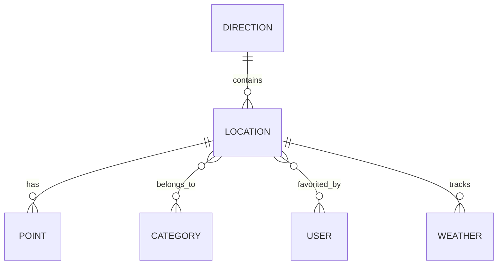

## Database Design Documentation

### Overview

The database is designed to store and manage location data, weather information, and user interactions for the Phuket Guru application.

### Entity Relationships

### Tables

#### Direction
Main geographical areas
- Primary key: id (string)
- Indexes: name

#### Location
Places within directions
- Primary key: id (cuid)
- Foreign key: directionId
- Indexes: slug, directionId

#### Point
Points of interest
- Primary key: id (cuid)
- Foreign key: locationId
- Indexes: locationId, category

#### Category
Location categories
- Primary key: id
- Indexes: name

#### Weather
Weather conditions
- Primary key: id (cuid)
- Foreign key: locationId
- Indexes: locationId, timestamp

#### User
User data and preferences
- Primary key: id (cuid)
- Unique: telegramId
- Indexes: telegramId

### Data Flow

1. Directions contain multiple Locations
2. Locations have multiple Points
3. Locations belong to Categories
4. Weather data is linked to Locations
5. Users can favorite Locations

### Optimization

- Appropriate indexes for common queries
- Normalized structure to minimize redundancy
- Efficient relationship design
- Timestamp tracking for all entities