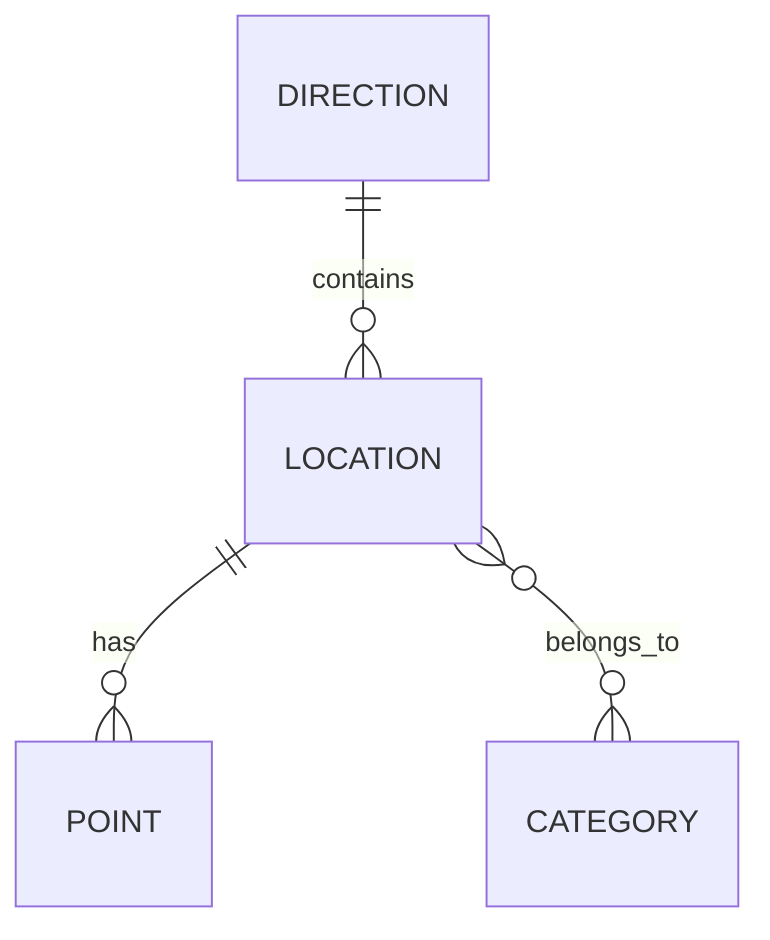

## Data Structure Documentation

### Overview
The application uses a hierarchical data structure to organize locations and points of interest in Phuket.

### Core Entities

#### Direction
```typescript
interface Direction {
  id: string;          // Unique identifier
  name: string;        // Display name
  slug: string;        // URL-friendly name
  thumbnail: string;   // Main image URL
  description: string; // Detailed description
  rating?: number;     // Optional rating (0-5)
  activities?: number; // Number of available activities
  locations: Location[]; // Associated locations
}
```

#### Location
```typescript
interface Location {
  id: string;           // Unique identifier
  title: string;        // Display name
  slug: string;         // URL-friendly name
  thumbnail: string;    // Main image URL
  description?: string; // Optional description
  directionId: string;  // Reference to parent direction
  points: Point[];      // Associated points of interest
}
```

#### Point
```typescript
interface Point {
  id: string;           // Unique identifier
  title: string;        // Display name
  category: string;     // Type of point
  image: string;        // Image URL
  description: string;  // Detailed description
  locationId: string;   // Reference to parent location
}
```

### Relationships



### Categories
Points of interest are categorized into predefined types:
- ПЛЯЖ
- ОБЗОРНАЯ ПЛОЩАДКА
- ИСТОРИЯ И КУЛЬТУРА
- МЕСТО ДЛЯ ФОТО
- And more...

### Image Management
- Default fallback images for each entity type
- Support for null image values
- Consistent aspect ratios
- Optimized loading strategies

### Best Practices
1. Always use slugs for routing
2. Maintain referential integrity
3. Provide fallback images
4. Keep descriptions concise
5. Use proper typing